# ActCIM-Robust · 存算一体芯片非线性误差鲁棒性研究

<p align="center">
  <b>CIM Cubic Nonlinearity × ResNet-18 × Nonlinearity-Aware Training × α-Sweep Audit</b><br>
  面向存算一体芯片确定性激活非线性失真的敏感性分析、非线性感知训练与可审计鲁棒性增强方法。
</p>

<p align="center">
  
  
  
  
  
  
</p>

---

## 0. 项目一句话

**ActCIM-Robust** 是一个面向**存算一体（Computing-in-Memory, CIM）芯片确定性激活非线性失真**的开源研究项目：以三次多项式 $f_\alpha(x)=m\cdot[\alpha(x/m)^3+(1-\alpha)(x/m)]$ 建模 CIM 阵列的激活传输非线性，系统分析其对 ResNet-18 推理精度与置信度校准的影响，提出并公平对比三种非线性感知训练（NAT）策略，最终给出一套**数字全部可由 CSV / 日志 / checkpoint 追溯**的鲁棒性增强方案与结果审计说明。

> 当前仓库定位：**完整可复现工程 + 11 点 α-Sweep 统一评估协议 + 10 张论文级图表 + 论文/PPT/网页演示交付物 + 工程级结果审计**。

---

## 1. 为什么做这个项目：应用场景与真实痛点

存算一体芯片把乘累加运算直接下沉到存储阵列内部，绕开了冯诺依曼架构反复搬运数据造成的"存储墙"，能效可获数量级提升，是边缘 AI 与大模型推理的重要方向。但模拟计算是有代价的：受**驱动放大、位线电荷传输、ADC 有限线性区**等物理机制影响，乘累加结果对输入幅度呈现**输入相关的确定性非线性响应**，激活在网络中逐层传播时失真被不断累积放大。

现有的抗噪研究大多聚焦**权重侧的随机噪声**（写入误差、器件涨落），而对**激活侧的确定性非线性**关注不足。这带来三个真实痛点：第一，**方向未知**——正向压缩与负向扩张对精度的破坏是否对称，没有系统结论；第二，**校准失效**——非线性不仅掉精度，还会破坏模型置信度，直接影响下游的拒识/降级决策；第三，**结果不可信**——很多鲁棒性工作训练口径与评估口径不一致、种子混用、指标定义含糊，导致"提升"难以复现。

本项目选择 **CIFAR-10 + ResNet-18** 作为受控实验平台，原因是：

1. **失真可控可复现**：非线性通过可插拔 wrapper 注入到 Conv2d/Linear 输入端，α 可全局或逐层设定，注入范围有实证核验。
2. **评估口径统一**：所有方法共用 11 点 α-Sweep（α∈[−0.8,+0.8]）、全测试集 10 000 张、同一套 Worst-Acc / AURC / ECE / 方向不对称指标。
3. **结论可审计**：每张图都在 `figures_manifest.json` 声明数据来源，头条数字经 checkpoint 复评核验，专门给出结果审计说明澄清种子口径与注入范围。

---

## 2. 项目亮点

| 亮点 | 说明 |
|---|---|
| 确定性非线性建模 | 赛题给定三次多项式 $f_\alpha$，逐张量动态最大值归一化，端点不动、处处可导，训练期可反传 |
| 方向敏感性定论 | 正 α（压缩）是主导失效方向：α=+0.8 掉 13pp，α=−0.8 仅掉 0.6pp；根源是判别信息破坏而非扰动幅度 |
| Fixed-NAT 鲁棒增强 | 用 0.21pp 干净精度代价将最差准确率提升 **10.54pp**（81.25%→91.79%），方向不对称差归零 |
| 三方法公平对比 | Fixed / Random / SGR 三种 NAT 同口径微调，随机化策略仅千分位增益 |
| 置信度校准分析 | 揭示强压缩引发**欠自信型置信度崩溃**（conf 0.25 / acc 0.81），Fixed-NAT 将 ECE 0.560→0.436 |
| 统一评估协议 | 11 点 α-Sweep + Worst-Acc + AURC（梯形积分）+ ECE + 方向不对称，方法间严格可比 |
| 工程级结果审计 | checkpoint sha256 清单 + α=0 指纹复评锁定 seed、注入范围实证、指标口径核验 |
| 完整交付闭环 | 20 页论文（MD/DOCX/PDF）+ 12 页 PPT + 14 页录屏演示网页 + 10 张 300DPI 图 |

---

## 3. 总体技术路线：从基线到可审计鲁棒性

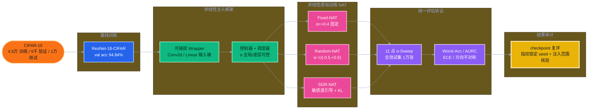

<p align="center">
  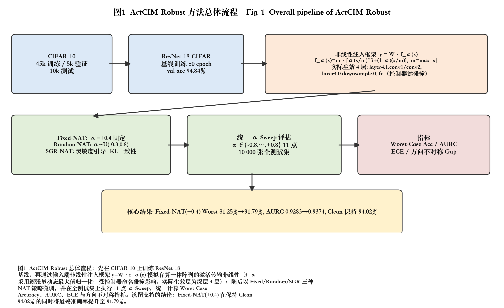
</p>
<p align="center"><sub><b>图 1 · ActCIM-Robust 方法总体流程。</b>先训练 ResNet-18 基线，再经输入端非线性注入框架 y=W·f_α(x) 模拟 CIM 阵列激活传输非线性，随后以三种 NAT 策略微调并在全测试集执行 11 点 α-Sweep 统一评估。<br/><i>图片来源：results/figures/paper_final/fig01_pipeline.png（300 DPI PNG + 矢量 PDF）；数据来自 src/actcim_robust/nonlinearity/、fixed_nat_comparison.json、verify_injection_scope.py。</i></sub></p>

---

## 4. 非线性误差建模：三次多项式映射

CIM 阵列的激活传输非线性用赛题给定的单参数三次多项式建模，$m=\max|x|$ 逐张量动态归一化，保证端点 $f_\alpha(\pm m)=\pm m$ 不动、函数处处可导：

$$f_\alpha(x) = m\cdot\left[\alpha\left(\frac{x}{m}\right)^3 + (1-\alpha)\left(\frac{x}{m}\right)\right]$$

```python
def nonlinearity(x, alpha=0.0):
    max_val = x.abs().max()   # 逐张量动态归一化因子 m
    x = x / max_val
    y = alpha * (x**3) + (1 - alpha) * x
    return y * max_val
```

| α 取值 | 物理含义 | 对激活的影响 |
|---|---|---|
| α = 0 | 理想线性 | 无失真，退化为恒等映射 |
| α > 0 | 压缩（趋向三次饱和） | 中小幅值激活增益降到 1−α，**系统性削弱判别信息** |
| α < 0 | 扩张 | 中小幅值增益高于 1，扰动幅度更大但保持大小顺序 |

<p align="center">
  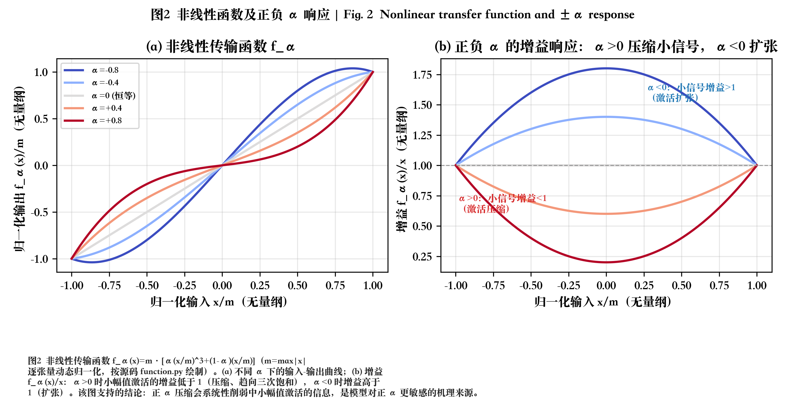
</p>
<p align="center"><sub><b>图 2 · 非线性传输函数与增益响应。</b>(a) 不同 α 下的输入-输出曲线；(b) 增益 f_α(x)/x：α&gt;0 压缩、α&lt;0 扩张。<br/><i>图片来源：results/figures/paper_final/fig02_nonlinearity.png；按源码 src/actcim_robust/nonlinearity/function.py 绘制。</i></sub></p>

---

## 5. 三种非线性感知训练（NAT）

三种策略都从**基线 checkpoint 微调**（而非从头训练），差别只在训练期 α 的取法：

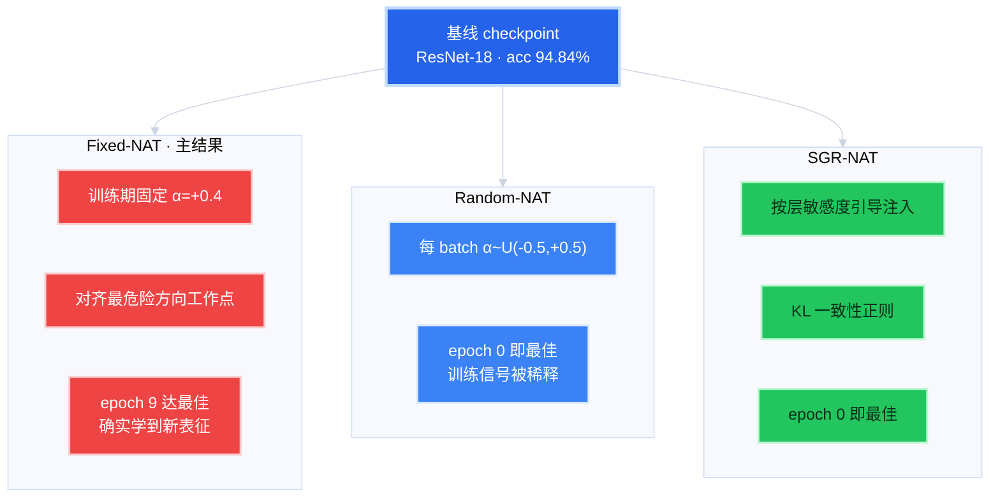

| 方法 | 训练期 α | 设计动机 | 收敛信号 |
|---|---|---|---|
| **Fixed-NAT** | 固定 +0.4 | 把模型放到最危险方向的中等强度工作点适应 | epoch 9 最佳，学到新表征 |
| Random-NAT | U(−0.5,+0.5) | 覆盖整个失真区间 | epoch 0 最佳，信号被随机化稀释 |
| SGR-NAT | 敏感度引导 + KL | 按层敏感度分配注入概率 | epoch 0 最佳 |

---

## 6. 统一评估协议与核心结果

所有方法在 **α∈[−0.8,+0.8] 共 11 个点**、**全测试集 10 000 张**、**seed 42 checkpoint** 上评估，指标口径统一：

- **Worst-Case Accuracy**：11 点中的最差准确率（均出现在 α=+0.8）
- **AURC**：Accuracy-α 曲线在 [−0.8,+0.8] 的梯形积分 ÷ 区间宽度 1.6
- **ECE**：15-bin 期望校准误差
- **方向不对称差**：正负半轴精度差，衡量失效方向对称性

| 方法 | Clean 准确率 (α=0) | 最差准确率 (α=+0.8) | AURC | 方向不对称差 |
|------|:---:|:---:|:---:|:---:|
| Clean 基线 | 94.23% | 81.25% | 0.9283 | −0.0314 |
| Random-NAT | 94.25% | 81.30% | 0.9281 | −0.0331 |
| SGR-NAT | 94.28% | 82.06% | 0.9290 | −0.0300 |
| **Fixed-NAT (α=+0.4)** | 94.02% | **91.79%** | **0.9374** | **+0.0007** |

<p align="center">
  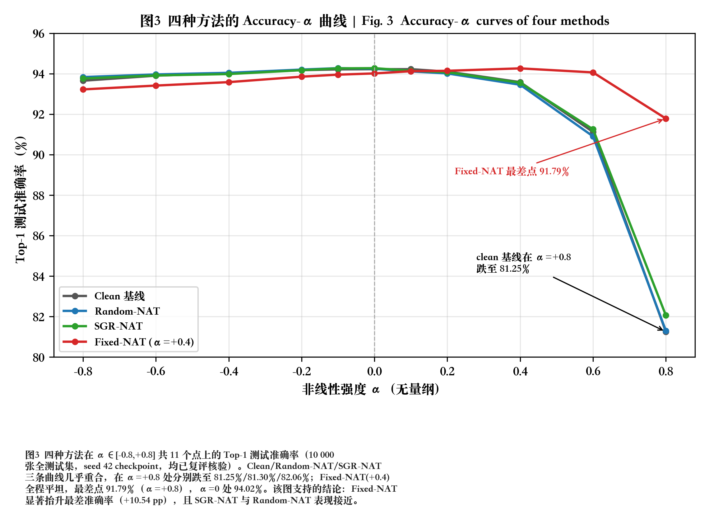
  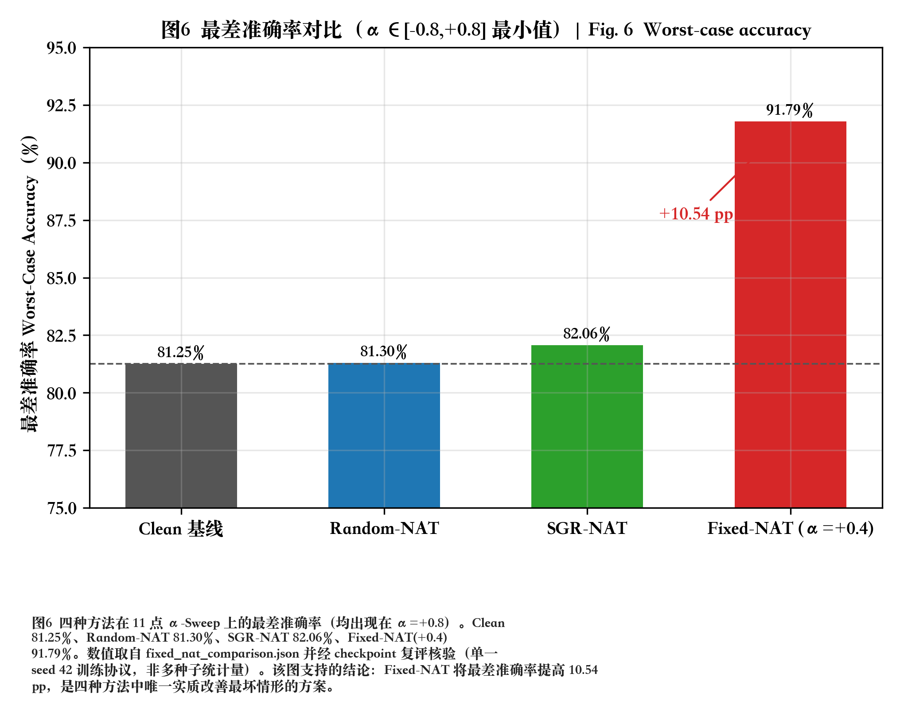
</p>
<p align="center"><sub><b>图 3（左）· 四种方法 Accuracy-α 曲线</b>：Clean/Random/SGR 三条几乎重合并在 α=+0.8 陡降，Fixed-NAT 全程平坦。<b>图 6（右）· 最差准确率对比</b>：Fixed-NAT 唯一实质抬升最坏情形（+10.54pp）。<br/><i>图片来源：results/figures/paper_final/fig03_alpha_sweep.png、fig06_worst_accuracy.png；数据来自 all_methods_alpha_sweep.csv、fixed_nat_alpha_sweep.csv、fixed_nat_comparison.json（均经 checkpoint 复评核验）。</i></sub></p>

<p align="center">
  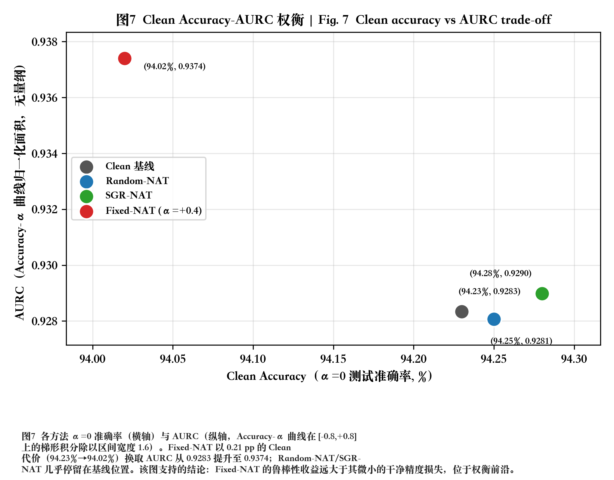
</p>
<p align="center"><sub><b>图 7 · 干净精度-鲁棒性权衡。</b>Fixed-NAT 以 0.21pp 的 Clean 代价（94.23%→94.02%）换取 AURC 0.9283→0.9374，独自位于权衡前沿；Random/SGR 几乎停在基线位置。<br/><i>图片来源：results/figures/paper_final/fig07_tradeoff.png；数据来自 results/post_training/fixed_nat_comparison.json。</i></sub></p>

> **一句话优化思路**：当部署期失真方向明确且近似恒定时，把训练预算集中到最危险方向的**单一工作点**，胜过摊薄到整个随机区间。

---

## 7. 敏感性分析：方向不对称与逐层累积

<p align="center">
  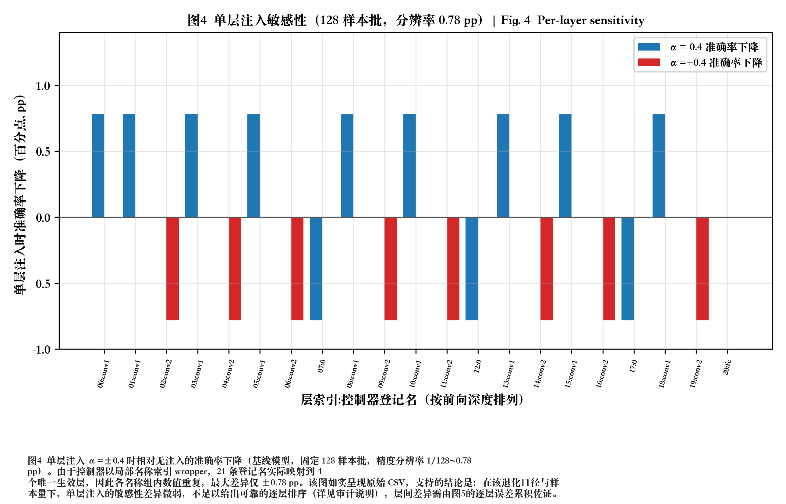
  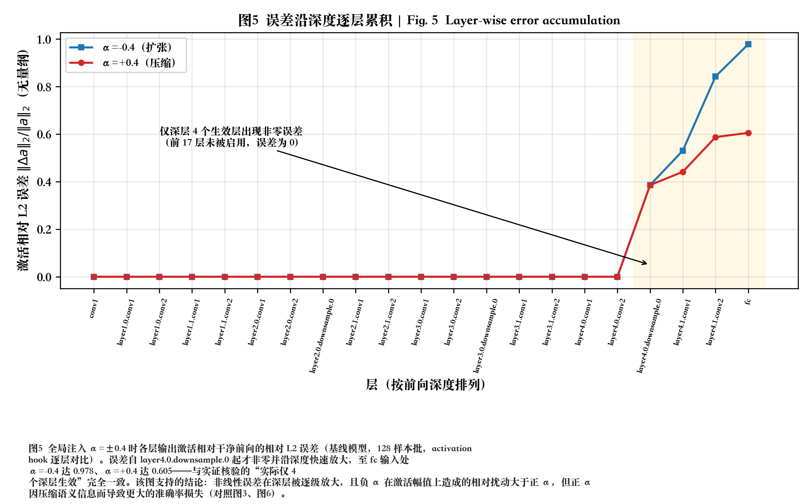
</p>
<p align="center"><sub><b>图 4（左）· 单层注入敏感性</b>：受控制器命名碰撞影响，21 条登记名实际映射到 4 个唯一生效层，单层敏感性差异微弱（≤±0.78pp），如实呈现原始 CSV。<b>图 5（右）· 误差逐层累积</b>：误差自 layer4.0.downsample.0 起非零，沿深度放大至 fc 输入 α=−0.4 达 0.978、α=+0.4 达 0.605。<br/><i>图片来源：results/figures/paper_final/fig04_layer_sensitivity.png、fig05_error_accumulation.png；数据来自 layer_sensitivity_ranked.csv、layer_error_accumulation.csv、verify_injection_scope.py。</i></sub></p>

一个**反直觉但关键**的现象：负 α 造成的激活扰动幅度其实更大（相对 L2 误差 0.98 vs 0.61），但精度损失反而更小。这说明**决定精度损失的不是扰动幅度，而是压缩对判别信息的语义破坏**——正 α 的符号翻转率是负 α 的三倍，这一机理直接决定了 Fixed-NAT 选择正向工作点的优化思路。

---

## 8. 拓展研究：置信度校准分析

<p align="center">
  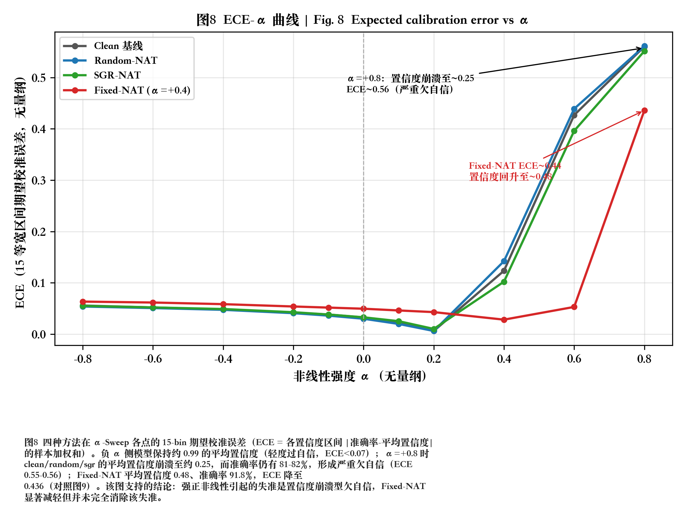
  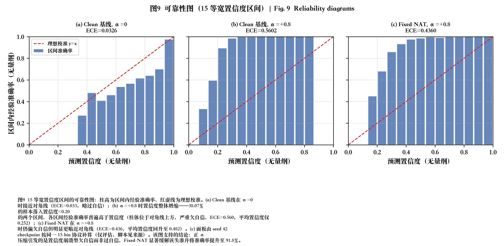
</p>
<p align="center"><sub><b>图 8（左）· ECE-α 曲线</b>：α=+0.8 时 Clean/Random/SGR 平均置信度崩溃至约 0.25 而准确率仍 81-82%，形成严重欠自信（ECE≈0.56）。<b>图 9（右）· 可靠性图</b>：(a) 基线 α=0 近对角线；(b) α=+0.8 柱体位于对角线上方（欠自信，ECE=0.560）；(c) Fixed-NAT 明显更贴近对角线（ECE=0.436）。<br/><i>图片来源：results/figures/paper_final/fig08_ece_alpha.png、fig09_reliability.png；数据来自 all_methods_alpha_sweep.csv、calibration/*_bins.csv、compute_fixed_nat_calibration.py。</i></sub></p>

与常见的"神经网络过自信"方向相反：强正非线性把 logit 幅值整体缩小，softmax 趋于均匀，模型变得"不敢确定"，是**欠自信型置信度崩溃**。这对下游的拒识与降级决策相对保守安全，但强失真区仍建议做温度缩放后校准。

---

## 9. 结果可信度：多种子一致性与工程审计

<p align="center">
  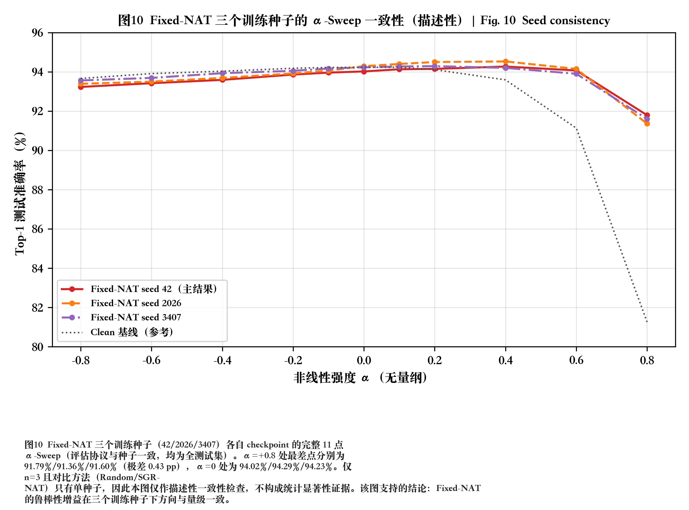
</p>
<p align="center"><sub><b>图 10 · Fixed-NAT 多训练种子一致性（描述性检查）。</b>三个训练种子（42/2026/3407）α=+0.8 最差点分别为 91.79%/91.36%/91.60%（极差仅 0.43pp）。仅 n=3 且对比方法为单种子，故本图仅作描述性一致性检查，<b>不构成统计显著性证据</b>。<br/><i>图片来源：results/figures/paper_final/fig10_multiseed.png；数据来自 fixed_nat_alpha_sweep.csv、multi_seed/fixed_nat_seed_{2026,3407}_alpha_sweep.csv。</i></sub></p>

本项目对全部结果做了**工程级审计**（详见 `reports/final/result_audit_statement.md`）：

1. **种子口径锁定**：重新加载四个 checkpoint 在全测试集复评，用 α=0 的精度指纹实证锁定头条数字来自 **seed 42**，解决报告中"推荐模型 seed 2026 vs checkpoint seed 42"的口径不一致。
2. **注入范围核验**：实证确认非线性实际作用于网络**深层 4 层**（控制器命名碰撞导致 21 条登记名映射到 4 个唯一层），训练与评估同口径，结论限定为"深层非线性扰动模型"。
3. **指标口径核验**：AURC 为梯形积分 ÷ 1.6（非算术平均），Random-NAT 分布为 U(−0.5,+0.5)。
4. **不宣称过度**：多数对比方法为单种子，全程只作描述性检查，不宣称多随机种子统计显著性。

---

## 10. 目录结构

```text
存算一体/
├── README.md                          # 本文件
├── .gitignore                         # 排除 checkpoint / 原始数据 / rar
├── ActCIM-Robust/                     # 主项目（可复现工程）
│   ├── src/actcim_robust/             # 框架源码
│   │   ├── nonlinearity/              # 非线性注入：函数/wrapper/控制器/调度器
│   │   ├── models/                    # ResNet-18/20、TinyCNN + 工厂
│   │   ├── training/                  # Trainer + baseline/fixed/random/sgr NAT
│   │   ├── evaluation/                # 准确率/ECE/AURC/Worst-Acc 指标库
│   │   ├── analysis/                  # α-Sweep / 层敏感性 / 误差累积
│   │   ├── visualization/             # Matplotlib 标准化绘图
│   │   ├── data/                      # CIFAR-10 加载与划分
│   │   └── cli.py                     # 统一命令行入口
│   ├── configs/                       # YAML 实验配置（基线 / 三种 NAT / α 扫描）
│   ├── scripts/paper/                 # build_docx.py / build_pptx.py 等论文工具
│   ├── tests/                         # pytest 单元与冒烟测试
│   ├── results/
│   │   ├── post_training/             # α-Sweep CSV/JSON、校准分箱、多种子
│   │   ├── analysis/                  # 层敏感性 / 误差累积 CSV
│   │   ├── figures/paper_final/       # 10 张论文图（PNG+PDF）+ figures_manifest.json
│   │   └── manifests/                 # checkpoint_inventory（sha256 清单）
│   ├── reports/final/                 # 论文 MD/DOCX/PDF、12页 PPTX、references.bib、审计说明
│   └── data/splits/                   # 训练/验证划分索引（CIFAR-10 原始数据需自行下载）
└── web_presentation/                  # 14 页录屏演示网页
    ├── index.html / style.css / script.js
    ├── video_script.md                # 10 分钟演示视频口播脚本（含时间码）
    ├── export_pdf.py                  # 网页 → 每页一张的 16:9 PDF
    └── assets/                        # fig01–fig10 副本
```

---

## 11. 快速开始

### 11.1 安装

```bash
cd ActCIM-Robust
pip install -r requirements.txt
pip install -e .

python -m actcim_robust.cli check-env      # 环境检查
python -m actcim_robust.cli test           # 运行测试
```

### 11.2 训练与分析

```bash
# 基线 / NAT 训练
python -m actcim_robust.cli train --config configs/baseline.yaml --seed 42
python -m actcim_robust.cli train --config configs/fixed_nat.yaml  --seed 42
python -m actcim_robust.cli train --config configs/random_nat.yaml --seed 42
python -m actcim_robust.cli train --config configs/sgr_nat.yaml    --seed 42

# 评估与分析
python -m actcim_robust.cli alpha-sweep         # α ∈ [-0.8,0.8] 11 点扫描
python -m actcim_robust.cli layer-sensitivity   # 逐层敏感性
python -m actcim_robust.cli error-accumulation  # 误差累积分析
python -m actcim_robust.cli unified-sweep       # 统一评估
python -m actcim_robust.cli build-figures       # 生成论文图表
python -m actcim_robust.cli build-report        # 生成报告
python -m actcim_robust.cli validate-results    # 结果校验
```

### 11.3 网页演示与录屏

```bash
cd web_presentation
python3 -m http.server 8735    # 浏览器打开 http://localhost:8735
# 按 F 全屏，→/← 翻页，点击图片放大；支持 #page-N 直达
python3 export_pdf.py          # 导出为每页一张的 16:9 PDF
```

---

## 12. 命令行接口

统一入口 `python -m actcim_robust.cli`（或安装后的 `actcim_robust`）：

| 子命令 | 说明 |
|---|---|
| `check-env` | 环境与依赖检查 |
| `test` | 运行测试套件 |
| `train` | 训练，支持 `--config/--seed/--checkpoint/--profile/--method` |
| `alpha-sweep` | α∈[−0.8,+0.8] 11 点准确率/ECE/AURC 扫描 |
| `layer-sensitivity` | 逐层单点注入敏感性分析 |
| `error-accumulation` | 逐层相对 L2 误差累积分析 |
| `unified-sweep` | 四方法统一评估 |
| `build-figures` | 生成 10 张论文级图表 |
| `build-report` | 生成技术报告 |
| `validate-results` | 结果一致性校验 |

---

## 13. 大文件说明

为控制仓库体积，以下内容**不随仓库分发**（已在 `.gitignore` 排除）：

| 内容 | 大小 | 获取方式 |
|---|---|---|
| CIFAR-10 原始数据 | 178 MB | [官网下载](https://www.cs.toronto.edu/~kriz/cifar.html) 解压至 `ActCIM-Robust/data/raw/` |
| 模型 checkpoint（16 个 `.pt`） | 85 MB/个 | 按上述命令重新训练，或联系作者获取 |

checkpoint 的 sha256 指纹与复评结果记录在 `results/manifests/checkpoint_inventory.json` 与 `reports/final/checkpoint_reverification.json`，可用于校验复现一致性。

---

## 14. 交付物清单

| 交付物 | 位置 |
|---|---|
| 设计报告（20 页，MD/DOCX/PDF） | `ActCIM-Robust/reports/final/ActCIM_Robust_paper_final.*` |
| 介绍 PPT（12 页可编辑） | `ActCIM-Robust/reports/final/ActCIM_Robust_slides.pptx` |
| 论文插图（10 张 300 DPI PNG + 矢量 PDF） | `ActCIM-Robust/results/figures/paper_final/fig01–fig10` |
| 参考文献（BibTeX） | `ActCIM-Robust/reports/final/references.bib` |
| 结果审计说明 | `ActCIM-Robust/reports/final/result_audit_statement.md` |
| 网页演示 + 视频脚本 | `web_presentation/` |

---

## 15. 当前限制与后续优化

1. **注入范围**：受控制器命名碰撞影响，实际注入生效于深层 4 层，后续将实现真正的全层逐层注入。
2. **多种子覆盖**：仅 Fixed-NAT 有 3 个训练种子，对比方法为单种子，后续补齐多种子以支持统计显著性检验。
3. **场景范围**：当前限于 CIFAR-10 + ResNet-18，后续扩展到 ImageNet、Transformer 及更多网络。
4. **硬件在环**：当前为软件模拟非线性，后续将在真实存算一体硬件上做在环验证。
5. **失真模型**：当前为单参数三次多项式，后续可引入器件级测量的更复杂失真曲线。

---

## 16. License

[MIT License](ActCIM-Robust/LICENSE) · Copyright (c) 2026 ActCIM-Robust

## Citation

如本项目对你的研究有帮助，请引用：

```bibtex
@misc{actcim_robust_2026,
  title  = {ActCIM-Robust: 存算一体芯片非线性误差鲁棒性研究与非线性感知训练},
  year   = {2026},
  url    = {https://github.com/ibh4/ActCIM_Robust}
}
```

## Acknowledgements

- [PyTorch](https://pytorch.org/) — 深度学习框架
- [CIFAR-10](https://www.cs.toronto.edu/~kriz/cifar.html) — 图像分类数据集
- [Matplotlib](https://matplotlib.org/) — 论文级图表绘制
- ISAAC / PRIME 等存算一体架构工作 — 研究背景参考（详见 `references.bib`）
